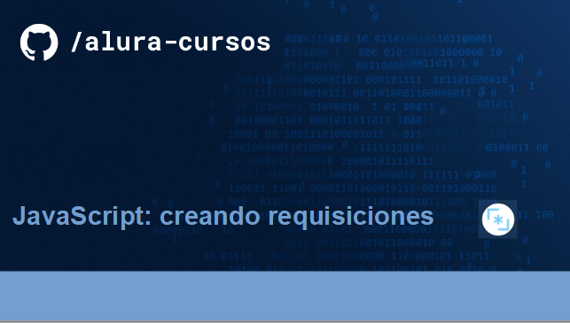
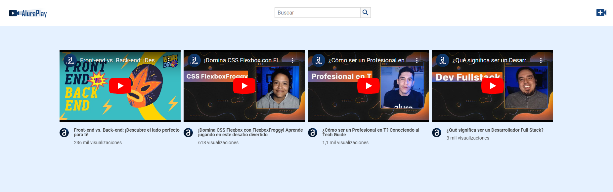
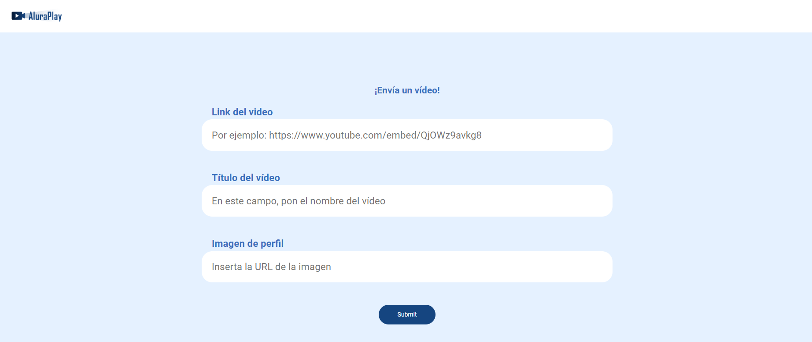

  

  

Página inicial y formulário de registro de vídeos de AluraPlay, una plataforma de intercambio de vídeos.

## Tecnologias utilizadas durante el curso
* Javascript
* NodeJS
* Json-server

## Tecnologias utilizadas en el projeto
* HTML
* CSS

## Screenshots

